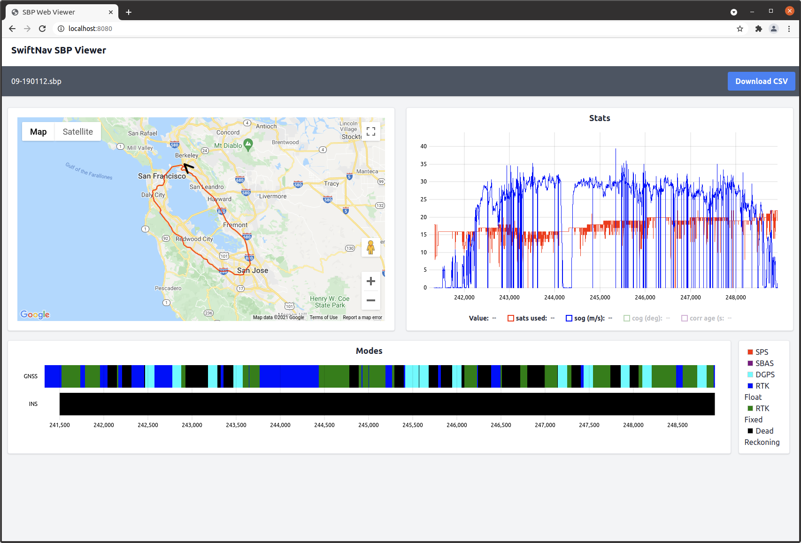

# SBP Online Viewer

The SBP Online Viewer allows for visualising data contained in a SBP file in a
browser, entirely by client side processing. It is an alternative to tools like
sbp2report and ICBINS (sbp2csv) and may be useful in situations where it is
difficult to install external tools.

It also synchronizes zooming across data plots and maps, which may be useful for
debugging.

It is hosted at:
## Screenshot


## Get Started
For local development, install all dependencies with:

```
npm install
cargo install wasm-pack
```

Then serve the site locally, this will rebuild when any of the
rust/html/javascript changes.

```
npm run serve
```

visit http://localhost:8080 in a browser to see it running.

## Architecture
The deserialisation of the binary sbp files is performed in wasm-compiled Rust
code that leverages the [ICBINS](https://github.com/swift-nav/ICBINS) project.
This returns arrays of data to Javascript code, which then plots the data using
[uPlot](https://github.com/leeoniya/uPlot) and Google Maps.

## Performance

On my i7 laptop, processing a 175 MB .sbp file takes:


| Tool          | Time (sec)    |
| ------------- |:-------------:|
| `sbp2report`     | 10s |
| `ICBINS` (release mode)      | 12s      |
| `sbp online viewer` (release mode) | 21s      |

Note that this comparison is not strictly fair as the online viewer is not
writing csv files to disk in this case, rather it is just presenting plots in
the browser. Still, it shows the relative speediness of wasm!